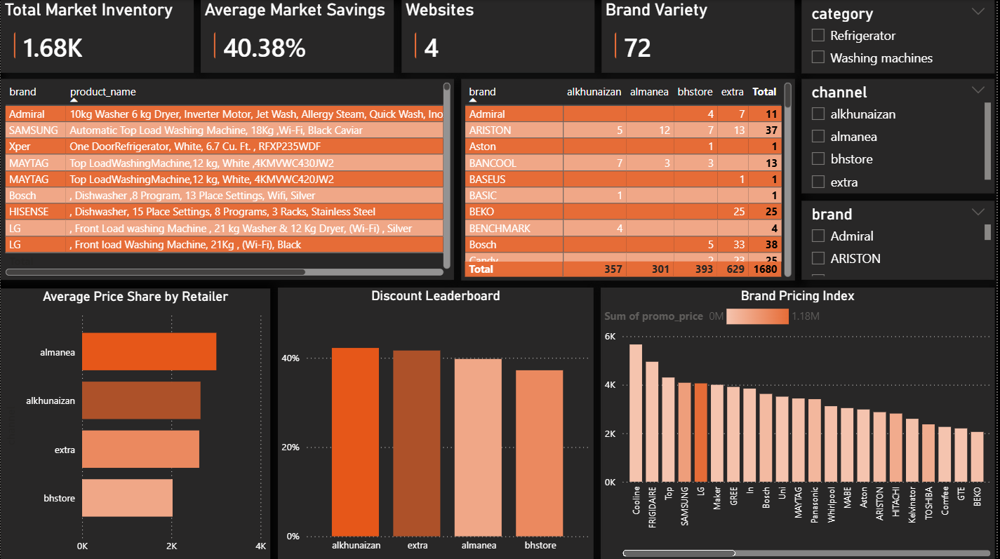

# 🇸🇦 Saudi Home Appliances Market Analysis (End-to-End Project)

## 📌 Project Overview
This project focuses on analyzing the home appliances market in Saudi Arabia by scraping data from the top 4 retailers: Almanea, Extra, Alkhunaizan, and BHStore.  

The project covers the complete data pipeline:
- Automated Web Scraping (Python & Selenium)
- Data Cleaning & Transformation (Excel Power Query)
- Data Modeling & Visualization (Power BI)

The analysis aims to answer key business questions such as:

- Which retailer offers the most competitive prices and highest discounts?
- Which brands dominate the Saudi market in the Washing Machines and Refrigerators categories?
- What is the price gap for the same brand across different platforms?

---

## 📂 Dataset Description

The dataset was built from scratch and processed through multiple stages:

### 🔹 Raw Data (Scraped)
4 datasets extracted directly from retailer websites including:
- Product Name  
- Regular Price  
- Promotional Price  
- Brand  
- Category  

### 🔹 Processed Files
Each retailer was cleaned and standardized separately using Excel Power Query.

### 🔹 Master Dataset
All retailers were appended into one consolidated dataset to enable cross-market comparison.

---

## ⚙️ Methodology

### 1️⃣ Web Scraping (Python & Selenium)
Developed 4 custom scraping scripts to handle:
- Dynamic content loading
- Infinite scrolling
- Pagination
- Different website structures

### 2️⃣ Data Cleaning & Transformation (Excel Power Query)
- Removing duplicates
- Handling missing values
- Standardizing inconsistent category names
- Unifying brand naming
- Extracting Capacity (Kg / Liters) using Regex
- Creating a unified Discount Percentage field

### 3️⃣ Data Integration
Used Append Queries to combine all retailers into one Master Table.

### 4️⃣ Final Dashboard (Power BI)
- Data Modeling
- DAX Measures
- KPIs
- Advanced Visualizations
- Interactive Slicers

---

## 🔍 Exploratory Analysis

Key analytical challenges addressed:

- Handling brand name inconsistency across platforms
- Extracting structured attributes from unstructured product titles
- Normalizing discount calculations across different pricing formats

---

## 📊 Final Dashboard

The interactive Power BI dashboard provides a 360° market overview.

### 📌 Key Performance Indicators (KPIs)
- Total Market Inventory: 1.68K+ Products
- Average Market Savings: 40.38%
- Brand Variety: 72 Brands
- Monitored Websites: 4

### 📌 Market Insights
- Price Share by Retailer
- Discount Leaderboard ("King of Offers")
- Brand Pricing Index (Premium → Budget)
- Availability Matrix (Retailer Exclusivity)

### 📌 Interactivity
- Category Slicer (Refrigerators / Washing Machines)
- Retailer Filter
- Brand Filter

---

## 🖼️ Visuals & Preview

### 📊 Main Market Dashboard

  

---

## 💡 Key Insights

- The Saudi appliances market shows a high average discount rate (~40%).
- Strong competition exists between retailers with noticeable price variance.
- Global brands like Samsung and LG dominate inventory share.
- Some retailers apply aggressive discount strategies to gain pricing advantage.

---

## 🛠️ Tools Used

- Python (Selenium & BeautifulSoup) → Web Scraping  
- Excel Power Query → Data Cleaning & Transformation  
- Power BI → Data Modeling & Visualization  

---

## 📁 Project Structure

### 🐍 Web Scraping Scripts
- `almanea_code.py`
- `extra.py`
- `alkhunaizan.py`
- `BH.py`

### 📊 Cleaned Excel Files
- `Almanea_ALL.xlsx`
- `Extra_All.xlsx`
- `alkhunaizan_ALL.xlsx`
- `BH_ALL.xlsx`

### 📈 Power BI Dashboard
- `Saudi Home Appliances.pbix`

